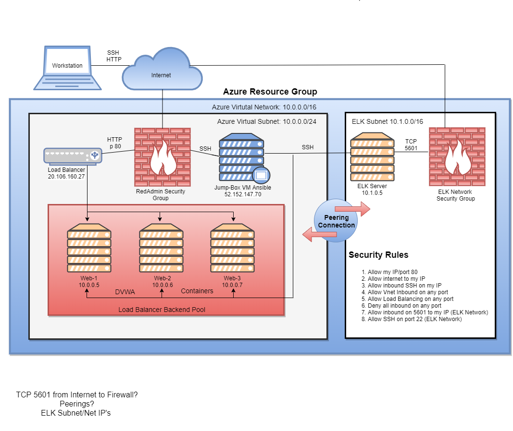
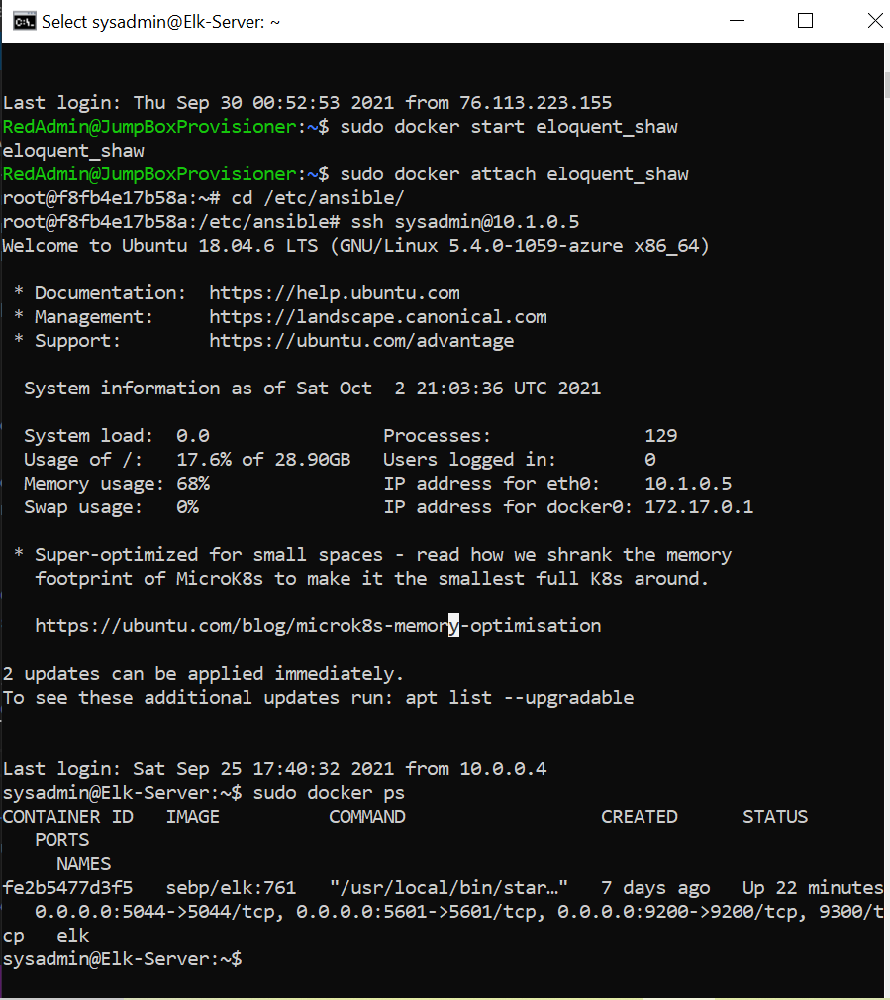
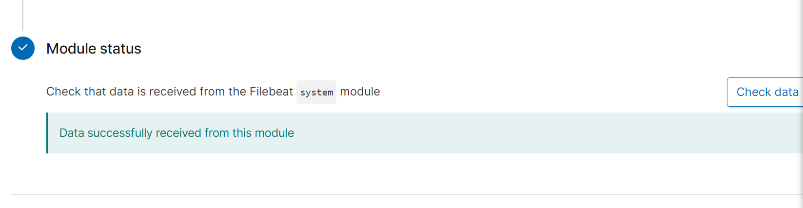
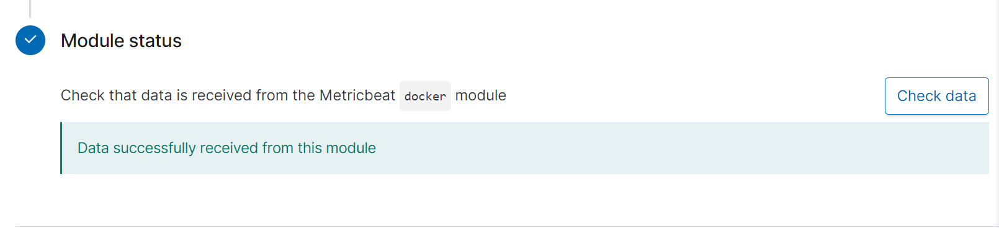
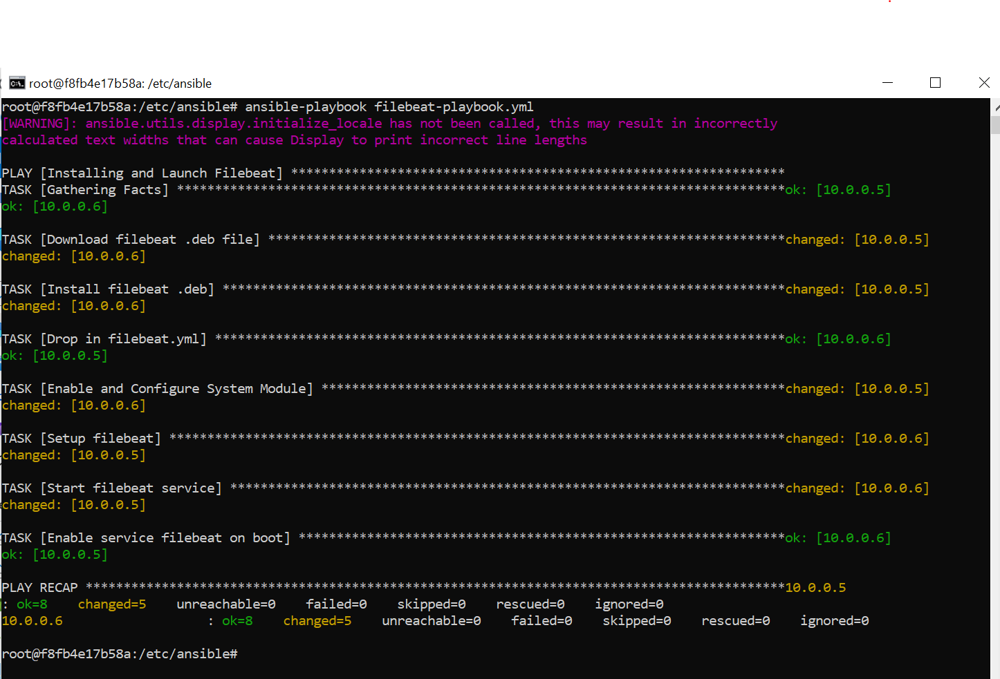
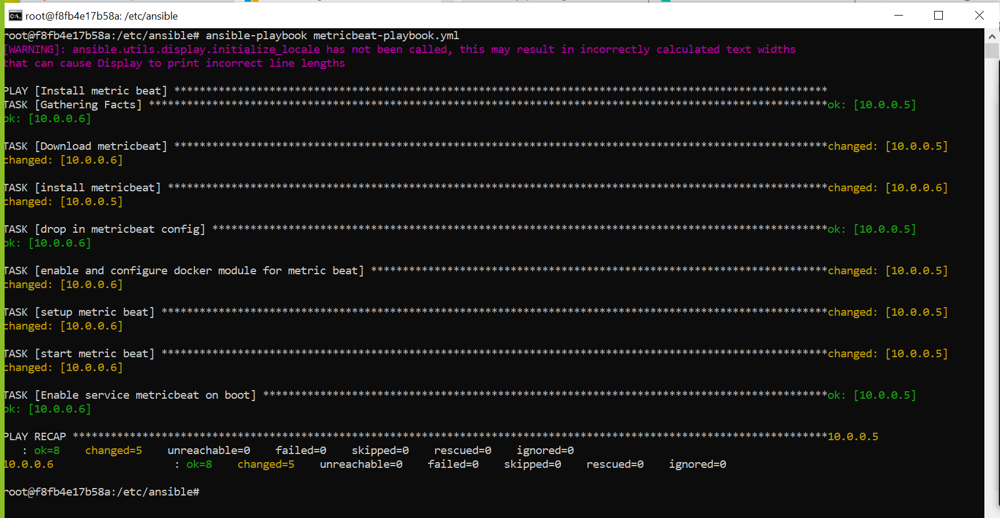
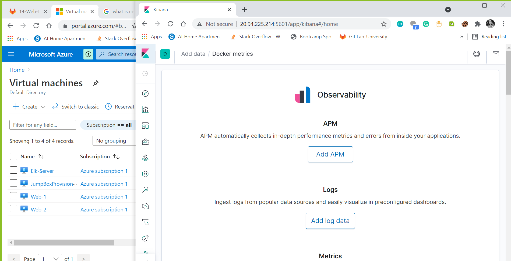

## Automated ELK Stack Deployment

The files in this repository were used to configure the network depicted below.

Elk Diagram

These files have been tested and used to generate a live ELK deployment on Azure. They can be used to either recreate the entire deployment pictured above. Alternatively, select portions of the **YAML** file may be used to install only certain pieces of it, such as Filebeat.

[Elk Playbook File](./install-elk.yml)

This document contains the following details:
- Description of the Topology
- Access Policies
- ELK Configuration
  - Beats in Use
  - Machines Being Monitored
- How to Use the Ansible Build

### Description of the Topology

The main purpose of this network is to expose a load-balanced and monitored instance of DVWA, the D*mn Vulnerable Web Application.

Load balancing ensures that the application will be highly **available**, in addition to restricting **access** to the network.

What aspect of security do load balancers protect? 

    Load balancers protect the availability of an application while preventing Dos attacks by distrubuting the network across multiple servers.
    
    Load balancers provide a public IP address and then receieves traffic that is routed to multiple servers, all which can be accessed by the internet. 

What is the advantage of a jump box?

    A Jump Box acts as a gateway router in a cloud network environment, filtering traffic while acting as a provisioner that automates and configures containers and VM's.

Integrating an ELK server allows users to easily monitor the vulnerable VMs for changes to the **data** and system **logs.**

What does Filebeat watch for?
    **Collects all the file data from all file systems in a server.**

What does Metricbeat record?
    **Collects machine data metrics such as Memory, CPU and RAM.**

The configuration details of each machine may be found below.

| Name     | Function | IP Address | Operating System |
|----------|----------|------------|------------------|
| Jump Box | Gateway  | 10.0.0.1   | Linux            |
| Web-1    |   Server |  10.0.0.5  | Linux            |
| Web-2    |  Server  |  10.0.0.6  | Linux            |
| Elk-Server| Monitoring Server  | 10.1.0.5 |Linux    |
| Cameo's Computer | Host | My IP | Windows | 

### Access Policies

The machines on the internal network are not exposed to the public Internet. 

Only the **jump box** machine can accept connections from the Internet. Access to this machine is only allowed from the following IP addresses:

    JumpBox Public IP: 52.152.147.70

Machines within the network can only be accessed by **jump box.** 

Which machine did you allow to access your ELK VM? What was its IP address?

    I allowed the ELk Server to access Web-1 (10.0.0.5) and Web-2 (10.0.0.6). 

A summary of the access policies in place can be found in the table below.

| Name     | Publicly Accessible | Allowed IP Addresses |
|----------|---------------------|----------------------|
| Jump Box | Yes            | 10.0.0.0/16 - 10.1.0.0/16  |
|Elk Server | No            | 10.1.0.5  |
| Web-1 |   No              | 10.0.0.0/16 - 10.1.0.0/16 |
| Web-2 |   No | 10.0.0.0/16 - 10.1.0.0/16 | 
|Cameo's Computer | Yes | IP | 
### Elk Configuration

Ansible was used to automate configuration of the ELK machine. No configuration was performed manually, which is advantageous because...
What is the main advantage of automating configuration with Ansible?

        An advantage to automating the ELK machine with Ansible is that, should it be compromized in any way, Ansible will deploy its reconstruction through a set of scripts in a file. This file is readable to everyone and can recreate an etire system in a short amount of time. Ansible has the ability to deploy systems on thousands of computers at a time.

The playbook implements the following tasks: 

- Install docker .io
- Install pip3 (Python3)
- Install Docker python module 
- Use more memory
- Download and launch a docker elk container
- Enable service docker on boot

The following screenshot displays the result of running **docker ps** after successfully configuring the ELK instance.

### Target Machines & Beats
This ELK server is configured to monitor the following machines:
List the IP addresses of the machines you are monitoring

        Web-1 IP: 10.0.0.5
        Web-2 IP: 10.0.0.6

We have installed the following Beats on these machines:
Specify which Beats you successfully installed:

        Filebeats
        Metricbeats

These Beats allow us to collect the following information from each machine:

- _TODO: In 1-2 sentences, explain what kind of data each beat collects, and provide 1 example of what you expect to see. E.g., 

**Winlogbeat** collects Windows logs, which we use to track user logon events, etc._

    Filebeat is a light-weight shipper that centralizes and forwards data logs.
    Metricbeat is also a light-weight shipper that collects metric from your system and services. From CPU to Memory, Load to Network and Redis to NGINX and much more it is a light-weight way to send system and service statistics. Metricbeat collects data from your filebeat and sends it to your monitoring cluster.   
    
    For exmaple, Filebeat would collect changed passwords or modified files with a timestamp. 

    

*^^ cameo change the above description* 

### Using the Playbook 
In order to use the playbook, you will need to have an Ansible control node already configured. Assuming you have such a control node provisioned: 

SSH into the control node and follow the steps below: 
- Copy the _____ file to _____.
- Update the _____ file to include...
- Run the playbook, and navigate to ____ to check that the installation worked as expected.

- Answer the following questions to fill in the blanks:

- Which file is the playbook? Where do you copy it?

- Which file do you update to make Ansible run the playbook on a specific machine? How do I specify which machine to install the ELK server on versus which to install Filebeat on?

- Which URL do you navigate to in order to check that the ELK server is running?

_As a **Bonus**, provide the specific commands the user will need to run to download the playbook, update the files, etc.

### Commands I used to run the ansible playbooks and update files:

        cd /etc/ansible/files then run theses below
        ansible-playbook install-elk.yml
        ansible-playbook filebeat-playbook.yml and ansible-playbook metricbeat-playbook.yml
        http://20.80.180.39:5601/app/kibana 

### Below are the actual screenshots of the commands I ran:

 

### Configure Elk VM with Docker

 

 

### Install and launch filebeat

 

### Install and launch metricbeat

 

### Load Kibana webpage

