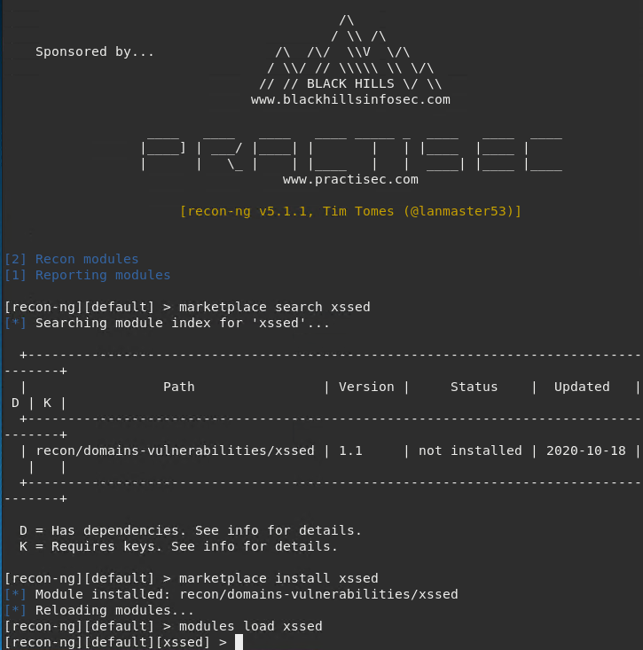
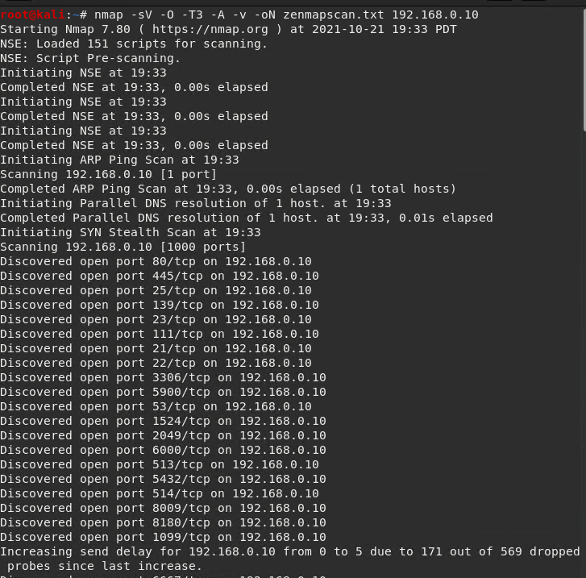

### Penetration Testing 1

 

#### Step 1: Google Dorking

- Using Google, can you identify who the Chief Executive Officer of Altoro Mutual is:

    `Karl Fitzgerald is the CEO of Altoro Mutual.`

  

- How can this information be helpful to an attacker:

    `If an attacker knows the CEO they can launch a whaling attack to gain all of the CEO's information such as their family info, sports, hobbies, pets, etc. Knowing this information will help an attacker gain access to passwords and login details and in the end, access to confidential/sensitive information of the company.` 

#### Step 2: DNS and Domain Discovery

Enter the IP address for `demo.testfire.net` into Domain Dossier and answer the following questions based on the results:

 

  1. Where is the company located: 
      `Sunnyvale, California.`

  

  2. What is the NetRange IP address:

      `65.61.137.64 - 65.61.137.127`

  

  3. What is the company they use to store their infrastructure:

      They use https://www.rackspace.com/ a cloud solutions and infrastructure.  

  4. What is the IP address of the DNS server:

      IP: 65.61.137.117

  

#### Step 3: Shodan

- What open ports and running services did Shodan find:

  Shodan.io shows that IP 65.61.137.117 has ports 80, 443, and 8080 open. 

#### Step 4: Recon-ng

- Install the Recon module `xssed`. 

- Set the source to `demo.testfire.net`. 
- Run the module. 

Is Altoro Mutual vulnerable to XSS: 

Clicking on the reference website also shows this information and that the website is vulnerable to XSS attacks. 

### Step 5: Zenmap

Your client has asked that you help identify any vulnerabilities with their file-sharing server. Using the Metasploitable machine to act as your client's server, complete the following: 

- Command for Zenmap to run a service scan against the Metasploitable machine: 
 
 `nmap -sV -O -T3 -A -v 192.168.0.10`

 

- Bonus command to output results into a new text file named `zenmapscan.txt`:

- Zenmap vulnerability script command: 
`nmap -sV -O -A --script ftp-vsftpd-backdoor 192.168.0.10`

- Once you have identified this vulnerability, answer the following questions for your client:

  1. What is the vulnerability:

      `This server gives the hacker access to files through FTP attacks to IP address 192.168.0.10. This can give a hacker the ability to anonymously read/write to files.`

  2. Why is it dangerous:
      `This is dangerous because a hacker with the ability to read/write files can write malicious script into the target server.`

  3. What mitigation strategies can you recommendations for the client to protect their server: 

      `To mitigate this, a client can protect their server by:`
      - Investing in a firewall and configuring it appropriately. 
      - Using multi-factor authentication 
      - Keeping software up to date. 
      - Training users on security and phishing attacks. 
      - Using secure and complex passwords.

---
© 2020 Trilogy Education Services, a 2U, Inc. brand. All Rights Reserved.  
cat 