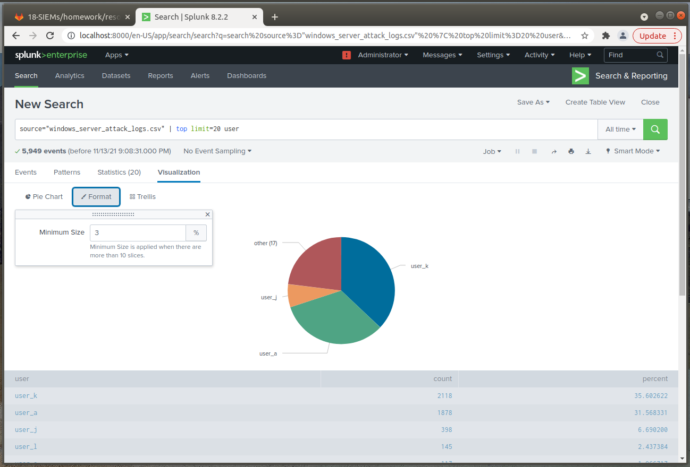
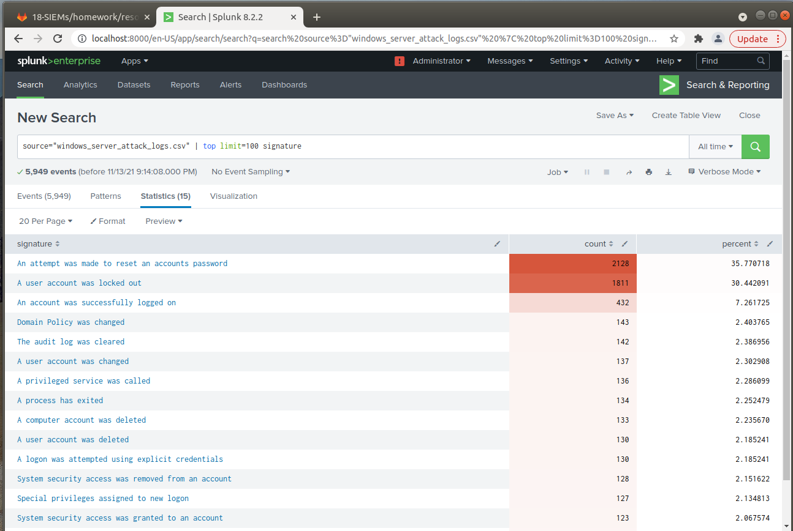
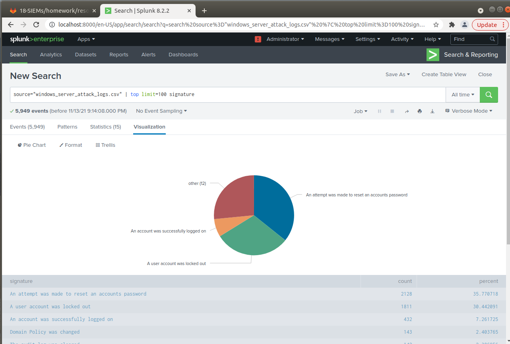
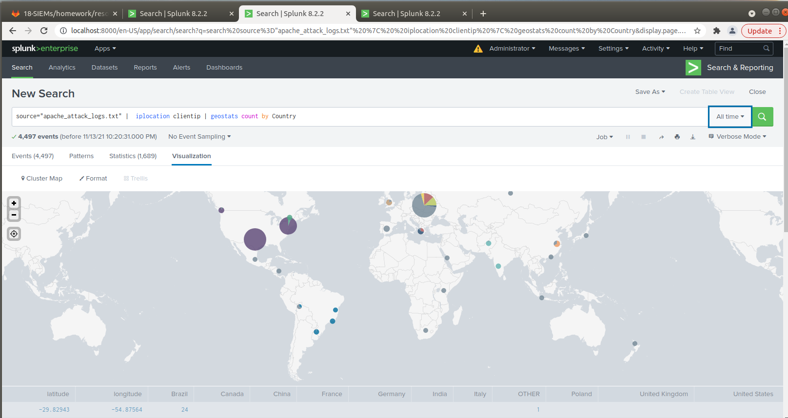
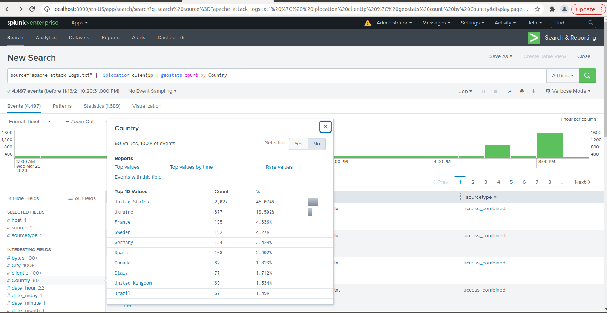

## Protecting VSI from Future Attacks

### Scenario

In the previous class,  you set up your SOC and monitored attacks from JobeCorp. Now, you will need to design mitigation strategies to protect VSI from future attacks. 

You are tasked with using your findings from the Master of SOC activity to answer questions about mitigation strategies.

### System Requirements 

You will be using the Splunk app located in the Ubuntu VM.

### Logs

Use the same log files you used during the Master of SOC activity:

- [Windows Logs](resources/windows_server_logs.csv)
- [Windows Attack Logs](resources/windows_server_attack_logs.csv)
- [Apache Webserver Logs](resources/apache_logs.txt	)
- [Apache Webserver Attack Logs](resources/apache_attack_logs.txt	)

---

### Part 1: Windows Server Attack

Note: This is a public-facing windows server that VSI employees access.
 
#### Question 1
- Several users were impacted during the attack on March 25th.

- Based on the attack signatures, what mitigations would you recommend to protect each user account? Provide global mitigations that the whole company can use and individual mitigations that are specific to each user.

  `To help protect against brute force attacks, I would recommend the company put better password policies into place. Two-factor-authentication, complex passwords, and requiring passwords be changed every 90 days will help prevent users from being impersonated. This should be required for the company as a whole and each user to keep the network as secure as possible.`

#### Question 2
- VSI has insider information that JobeCorp attempted to target users by sending "Bad Logins" to lock out every user.
- What sort of mitigation could you use to protect against this?

  `To prevent users from being locked out of their accounts due to bad actors, a company can set controls to send a "change your password" email to users so they can affectively regain access to their accounts.`

### Part 2: Apache Webserver Attack:

#### Question 1
- Based on the geographic map, recommend a firewall rule that the networking team should implement. 
- Provide a "plain english" description of the rule. 
  - For example: "Block all incoming HTTP traffic where the source IP comes from the city of Los Angeles."
- Provide a screen shot of the geographic map that justifies why you created this rule. 

  `Block all incoming HTTP traffic on port 80 where the source IP comes from Ukraine and has the IP 79.171.127.34 or IP 194.105.145.147. These logs were generated by the alert created for failed logins. With the majority of failed logins coming from these IP's, it is clear to say that the attack is coming from here and thus, traffic needs to be blocked to prevent further damage.`

#### Question 2

- VSI has insider information that JobeCorp will launch the same webserver attack but use a different IP each time in order to avoid being stopped by the rule you just created.

- What other rules can you create to protect VSI from attacks against your webserver?
  - Conceive of two more rules in "plain english". 
  - Hint: Look for other fields that indicate the attacker.

  Rules:
    - Block any IP address with more than 4 GET or POST requests in 1 minute.
    - Alert and forward any request that contains the *user agent* or *attack signature* that was used in the attack - i.e. user agent string “Mozilla/4.0 (compatible; MSIE 6.0; Windows NT 5.2; SV1; .NET CLR 2.0.50727987787; InfoPath.1)”. 
  

### Guidelines for your Submission:
  
In a word document, provide the following:
- Answers for all questions.
- Screenshots where indicated

Submit your findings in BootCampSpot!

---

© 2020 Trilogy Education Services, a 2U, Inc. brand. All Rights Reserved.
