## Unit 11 Submission File: Network Security Homework 

### Part 1: Review Questions 

#### Security Control Types

The concept of defense in depth can be broken down into three different security control types. Identify the security control type of each set  of defense tactics.

1. Walls, bollards, fences, guard dogs, cameras, and lighting are what type of security control?

    `Answer: Physical`

2. Security awareness programs, BYOD policies, and ethical hiring practices are what type of security control?

    `Answer: Administrative`

3. Encryption, biometric fingerprint readers, firewalls, endpoint security, and intrusion detection systems are what type of security control?

    `Answer: Technical`

#### Intrusion Detection and Attack indicators

1. What's the difference between an IDS and an IPS?

    `Answer: An IDS detects and issues alerts while an IPS takes action against alerted attacks.` 

2. What's the difference between an Indicator of Attack and an Indicator of Compromise?

   `Answer: An Indicator of Attack indicate attacks that are happening in real time. These attacks are currently in progress even if a full breach has not yet occured. Indicators of Compromise indicate malicious activity that has already occured. In this case, a breach has taken place.` 

#### The Cyber Kill Chain

Name each of the seven stages for the Cyber Kill chain and provide a brief example of each.

`1. Stage 1: Reconnaissance - social media.`

`2. Stage 2: Weaponization - virus or worm.`

`3. Stage 3: Delivery - anti-virus tools.`

`4. Stage 4: Exploitation - keep up-to-date on patches.`

`5. Stage 5: Installation - control admin rights.`

`6. Stage 6: Command and Control - proxy filters.`

`7. Stage 7: Actions on Objective - cyber insurance.`


#### Snort Rule Analysis

Use the Snort rule to answer the following questions:

Snort Rule #1

```bash
alert tcp $EXTERNAL_NET any -> $HOME_NET 5800:5820 (msg:"ET SCAN Potential VNC Scan 5800-5820"; flags:S,12; threshold: type both, track by_src, count 5, seconds 60; reference:url,doc.emergingthreats.net/2002910; classtype:attempted-recon; sid:2002910; rev:5; metadata:created_at 2010_07_30, updated_at 2010_07_30;)
```  

1. Break down the Snort Rule header and explain what is happening.

   `Answer: This alert shows that an external source is attempting to access the home_net in some capacity. The rule, ET SCAN POtential VNC(Virutal Network Computing-a graphical desktop sharing system used to remotely control a computer) Scan, suggests that the external source is trying to get remote access to the HOME_NET network.`

2. What stage of the Cyber Kill Chain does this alert violate?

   `Answer: Installation???`

3. What kind of attack is indicated?

   `Answer: VNC Scan is what is indicated in the alert. A VNC scan would be an attempt to remotely control a computer.`

Snort Rule #2

```bash
alert tcp $EXTERNAL_NET $HTTP_PORTS -> $HOME_NET any (msg:"ET POLICY PE EXE or DLL Windows file download HTTP"; flow:established,to_client; flowbits:isnotset,ET.http.binary; flowbits:isnotset,ET.INFO.WindowsUpdate; file_data; content:"MZ"; within:2; byte_jump:4,58,relative,little; content:"PE|00 00|"; distance:-64; within:4; flowbits:set,ET.http.binary; metadata: former_category POLICY; reference:url,doc.emergingthreats.net/bin/view/Main/2018959; classtype:policy-violation; sid:2018959; rev:4; metadata:created_at 2014_08_19, updated_at 2017_02_01;)
```

1. Break down the Sort Rule header and explain what is happening.

   `Answer: This alert shows that an external source is attempting to download an executable file (EXE) onto the HOME_NET network.` 

2. What layer of the Defense in Depth model does this alert violate?

   `Answer: Administration ???`

3. What kind of attack is indicated?

   `Answer: The attack the alert refers to is one that "violates company policy".`

Snort Rule #3

- Your turn! Write a Snort rule that alerts when traffic is detected inbound on port 4444 to the local network on any port. Be sure to include the `msg` in the Rule Option.

    `Answer: alert tcp any any -> destination IP 4444 {msg: EXE DOWNLOAD ATTEMPT}

### Part 2: "Drop Zone" Lab

#### Log into the Azure `firewalld` machine

Log in using the following credentials:

- Username: `sysadmin`
- Password: `cybersecurity`

#### Uninstall `ufw`

Before getting started, you should verify that you do not have any instances of `ufw` running. This will avoid conflicts with your `firewalld` service. This also ensures that `firewalld` will be your default firewall.

- Run the command that removes any running instance of `ufw`.

    ```bash
    $ sudo apt -y remove ufw
    ```

    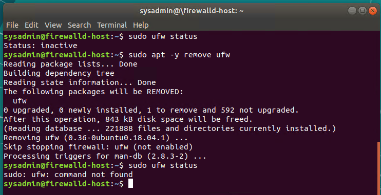

   
#### Enable and start `firewalld`

By default, these service should be running. If not, then run the following commands:

- Run the commands that enable and start `firewalld` upon boots and reboots.

    ```bash
    $ sudo systemctl enable firewalld
    $ sudo systemctl start firewalld
    ```

    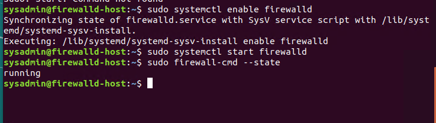

  Note: This will ensure that `firewalld` remains active after each reboot.

#### Confirm that the service is running.

- Run the command that checks whether or not the `firewalld` service is up and running.

    ```bash
    $ sudo firewall-cmd --state
    ```


#### List all firewall rules currently configured.

Next, lists all currently configured firewall rules. This will give you a good idea of what's currently configured and save you time in the long run by not doing double work.

- Run the command that lists all currently configured firewall rules:

    ```bash
    $ sudo firewall-cmd --list-all
    ```

    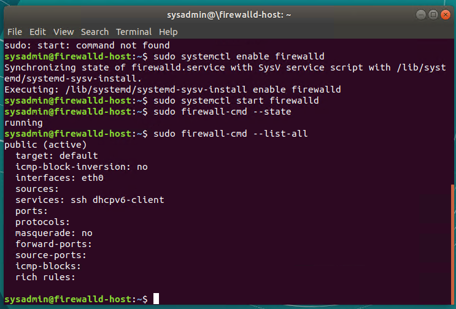

- Take note of what Zones and settings are configured. You many need to remove unneeded services and settings.

#### List all supported service types that can be enabled.

- Run the command that lists all currently supported services to see if the service you need is available

    ```bash
    $ sudo firewall-cmd --get-services
    ```

    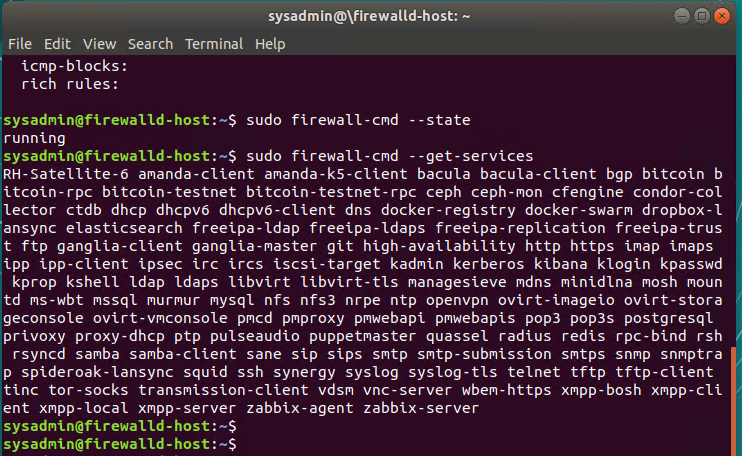

- We can see that the `Home` and `Drop` Zones are created by default.


#### Zone Views

- Run the command that lists all currently configured zones.

    ```bash
    $ sudo firewall-cmd --list-all-zones
    ```

    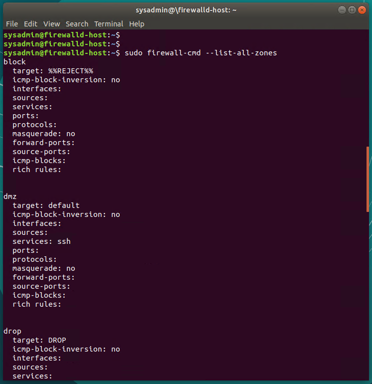

- We can see that the `Public` and `Drop` Zones are created by default. Therefore, we will need to create Zones for `Web`, `Sales`, and `Mail`.

#### Create Zones for `Web`, `Sales` and `Mail`.

- Run the commands that creates Web, Sales and Mail zones.

    ```bash
    $ sudo firewall-cmd --new-zone=Web --permanent
    $ sudo firewall-cmd --new-zone=Sales --permanent
    $ sudo firewall-cmd --new-zone=Mail --permanent
    ```

    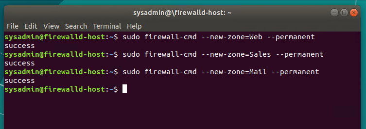

#### Set the zones to their designated interfaces:

- Run the commands that sets your `eth` interfaces to your zones.

    ```bash
    $ sudo firewall-cmd --zone=public --add-interface=ETH0
    $ sudo firewall-cmd --zone=Web --add-interface=ETH1
    $ sudo firewall-cmd --zone=Sales --add-interface=ETH2
    $ sudo firewall-cmd --zone=Mail --add-interface=ETH3
    ```

    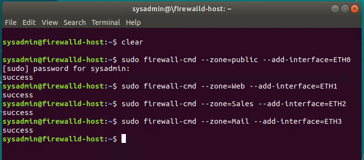

    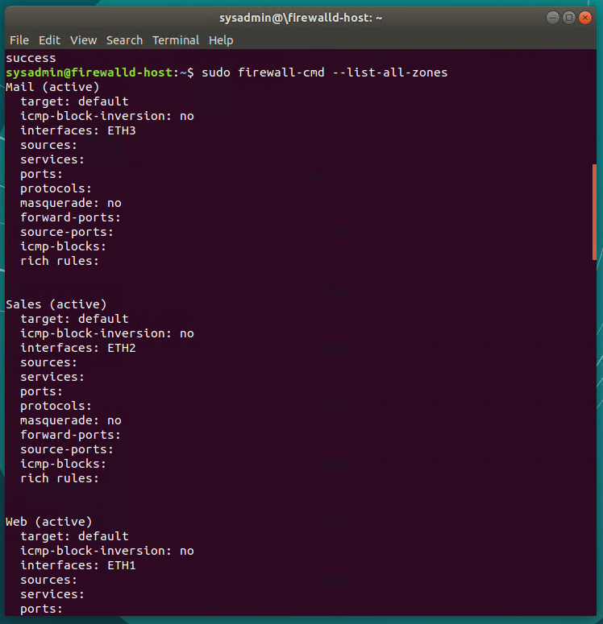


#### Add services to the active zones:

- Run the commands that add services to the **public** zone, the **web** zone, the **sales** zone, and the **mail** zone.

- Public:

    ```bash
    $ sudo firewall-cmd --permanent --add-service=smtp --zone=public
    $ sudo firewall-cmd --permanent --add-service=pop3 --zone=public
    $ sudo firewall-cmd --permanent --add-service=http --zone=public
    $ sudo firewall-cmd --permanent --add-service=https --zone=public
    ```

- Web:

    ```bash
    $ sudo firewall-cmd --permanent --add-service=http --zone=Web
    ```

- Sales

    ```bash
    $ sudo firewall-cmd --permanent --add-service=https --zone=Sales
    ```

- Mail

    ```bash
    $ sudo firewall-cmd --permanent --add-service=smtp --zone=Mail
    $ sudo firewall-cmd --permanent --add-service=pop3 --zone=Mail
    ```

    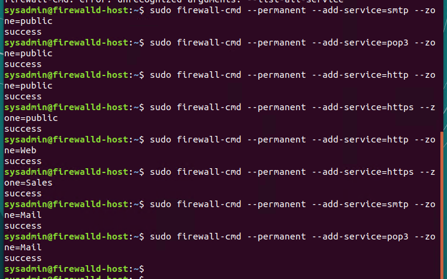

    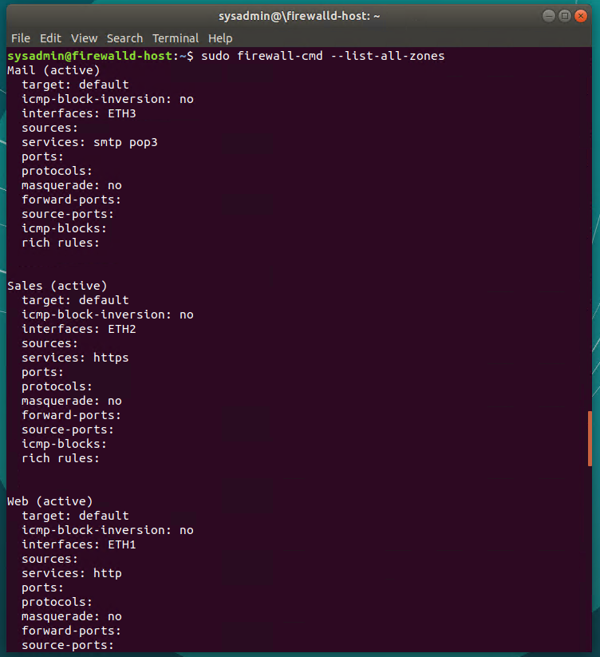


- What is the status of `http`, `https`, `smtp` and `pop3`?
    
    `$ Temporary. Unless "permanent" is put into the command.`

#### Add your adversaries to the Drop Zone.

- Run the command that will add all current and any future blacklisted IPs to the Drop Zone.

     ```bash
    $ sudo firewall-cmd --permanent --zone=drop --add-source=10.208.56.23
    $ sudo firewall-cmd --permanent --zone=drop --add-source=135.95.103.76
    $ sudo firewall-cmd --permanent --zone=drop --add-source=76.34.169.118
    ```

    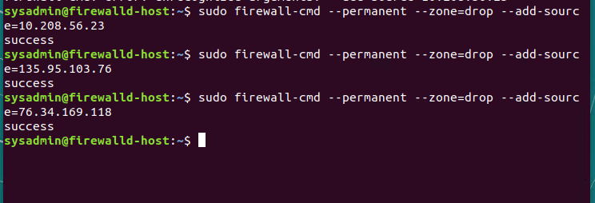

#### Make rules permanent then reload them:

It's good practice to ensure that your `firewalld` installation remains nailed up and retains its services across reboots. This ensure that the network remains secured after unplanned outages such as power failures.

- Run the command that reloads the `firewalld` configurations and writes it to memory

    ```bash
    $ sudo firewall-cmd --reload
    ```


#### View active Zones

Now, we'll want to provide truncated listings of all currently **active** zones. This a good time to verify your zone settings.

- Run the command that displays all zone services.

    ```bash
    $ sudo firewall-cmd --get-active-zones
    ```


#### Block an IP address

- Use a rich-rule that blocks the IP address `138.138.0.3`.

    ```bash
    $ sudo firewall-cmd --zone=public --permanent --add-rich-rule="rule family=ipv4 source address=138.138.0.3 reject"
    ```
    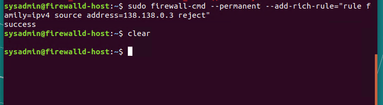

    *Rules in the public zone are --permanent by default. 

    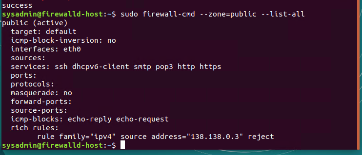


#### Block Ping/ICMP Requests

Harden your network against `ping` scans by blocking `icmp ehco` replies.

- Run the command that blocks `pings` and `icmp` requests in your `public` zone.

    ```bash
    $ sudo firewall-cmd --permanent --zone=public --add-icmp-block=echo-reply --add-icmp-block=echo-request
    ```

    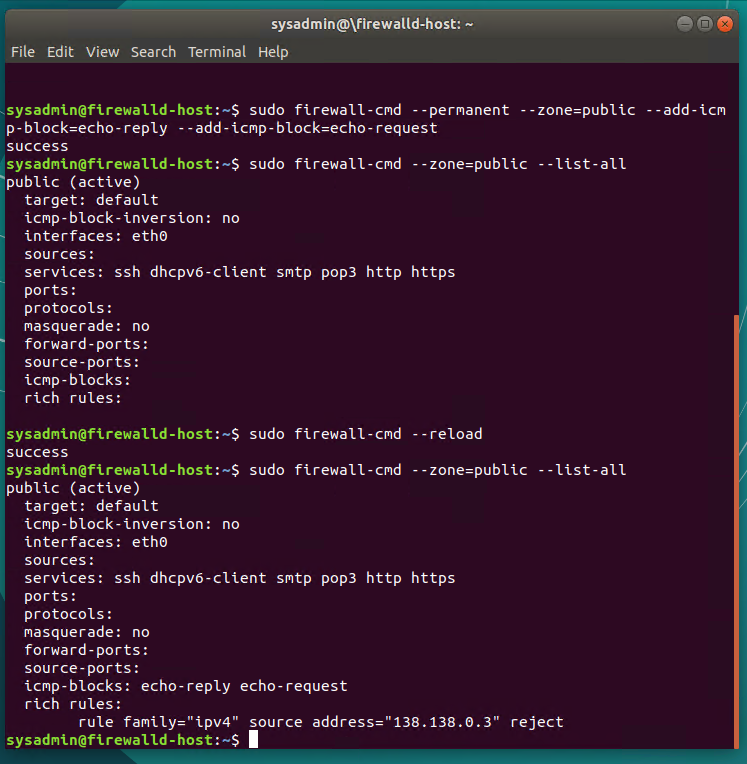

#Don't forget to reload after creating rules or blocks or altering zones to view in the zone information. 

#### Rule Check

Now that you've set up your brand new `firewalld` installation, it's time to verify that all of the settings have taken effect.

- Run the command that lists all  of the rule settings. Do one command at a time for each zone.

    ```bash
    $ sudo firewall-cmd --zone=public --list-all
    $ sudo firewall-cmd --zone=Web --list-all
    $ sudo firewall-cmd --zone=Sales --list-all
    $ sudo firewall-cmd --zone=Mail --list-all
    $ sudo firewall-cmd --zone=drop --list-all
    ```
- Are all of our rules in place? If not, then go back and make the necessary modifications before checking again.


Congratulations! You have successfully configured and deployed a fully comprehensive `firewalld` installation.

---

### Part 3: IDS, IPS, DiD and Firewalls

Now, we will work on another lab. Before you start, complete the following review questions.

#### IDS vs. IPS Systems

1. Name and define two ways an IDS connects to a network.

   `Answer 1: Signature-based detection.`

   `Answer 2: Anomaly-based detection.`

2. Describe how an IPS connects to a network.

   `Answer: Physical connection between destination and source.` 

3. What type of IDS compares patterns of traffic to predefined signatures and is unable to detect Zero-Day attacks?

   `Answer: Signature-based IDS.`

4. Which type of IDS is beneficial for detecting all suspicious traffic that deviates from the well-known baseline and is excellent at detecting when an attacker probes or sweeps a network?

   `Answer: Anomaly-based IDS.`

#### Defense in Depth

1. For each of the following scenarios, provide the layer of Defense in Depth that applies:

    1.  A criminal hacker tailgates an employee through an exterior door into a secured facility, explaining that they forgot their badge at home.

        `Answer: Physical layer, i.e. Access control Vestibules, access card or badge`

    2. A zero-day goes undetected by antivirus software.

        `Answer: Application Layer - antivirus software is an application.` 

    3. A criminal successfully gains access to HR’s database.

        `Answer: Data layer.`

    4. A criminal hacker exploits a vulnerability within an operating system.

        `Answer: Host layer.`

    5. A hacktivist organization successfully performs a DDoS attack, taking down a government website.

        `Answer: Internal Network layer.`

    6. Data is classified at the wrong classification level.

        `Answer: Policy, Procedures & Awareness.`

    7. A state sponsored hacker group successfully firewalked an organization to produce a list of active services on an email server.

        `Answer: Perimiter layer.`

2. Name one method of protecting data-at-rest from being readable on hard drive.

    `Answer: Encrypting hard drives.` 

3. Name one method to protect data-in-transit.

    `Answer: Encrypted connections such as HTTPS, SSL, and VPN.`

4. What technology could provide law enforcement with the ability to track and recover a stolen laptop.

   `Answer: Wifi, sim cards in devices, GPS location services, or device tokens.`

5. How could you prevent an attacker from booting a stolen laptop using an external hard drive?

    `Answer: Disk encryption.`


#### Firewall Architectures and Methodologies

1. Which type of firewall verifies the three-way TCP handshake? TCP handshake checks are designed to ensure that session packets are from legitimate sources.

  `Answer: Circuit-level firewall.`

2. Which type of firewall considers the connection as a whole? Meaning, instead of looking at only individual packets, these firewalls look at whole streams of packets at one time.

  `Answer: Stateless packet filtering firewall.`

3. Which type of firewall intercepts all traffic prior to being forwarded to its final destination. In a sense, these firewalls act on behalf of the recipient by ensuring the traffic is safe prior to forwarding it?

  `Answer: A proxy firewall.`


4. Which type of firewall examines data within a packet as it progresses through a network interface by examining source and destination IP address, port number, and packet type- all without opening the packet to inspect its contents?

  `Answer: Stateful packet filtering firewall.` 


5. Which type of firewall filters based solely on source and destination MAC address?

  `Answer: Mac layer firewall.`


### Bonus Lab: "Green Eggs & SPAM"
In this activity, you will target spam, uncover its whereabouts, and attempt to discover the intent of the attacker.
 
- You will assume the role of a Jr. Security administrator working for the Department of Technology for the State of California.
 
- As a junior administrator, your primary role is to perform the initial triage of alert data: the initial investigation and analysis followed by an escalation of high priority alerts to senior incident handlers for further review.
 
- You will work as part of a Computer and Incident Response Team (CIRT), responsible for compiling **Threat Intelligence** as part of your incident report. 

#### Threat Intelligence Card 

**Note**: Log into the Security Onion VM and use the following **Indicator of Attack** to complete this portion of the homework. 

Locate the following Indicator of Attack in Sguil based off of the following:

- **Source IP/Port**: `188.124.9.56:80`
- **Destination Address/Port**: `192.168.3.35:1035`
- **Event Message**: `ET TROJAN JS/Nemucod.M.gen downloading EXE payload`

Answer the following:

1. What was the indicator of an attack?
   - Hint: What do the details of the reveal? 

    Answer: There's an external source attempting to get the home network to click on an italian spam campaign that will then download an executable file. 

    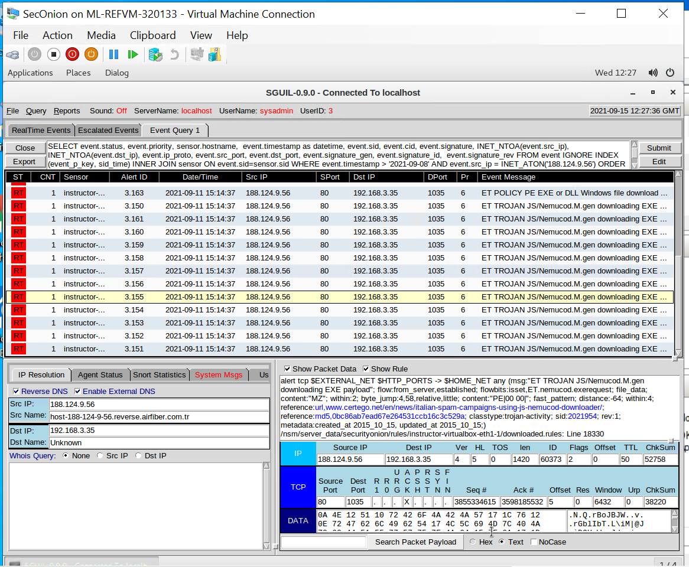


2. What was the adversarial motivation (purpose of attack)?

    Answer: The motivation of the attack is to get the user to download the executable file, a decoy PDF attachment that will then install malware of the users computer. 

    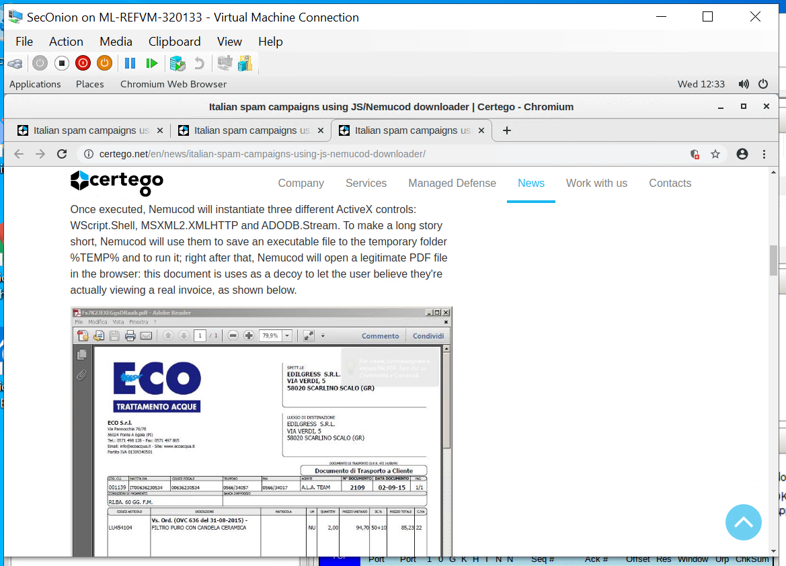


3. Describe observations and indicators that may be related to the perpetrators of the intrusion. Categorize your insights according to the appropriate stage of the cyber kill chain, as structured in the following table.

| TTP | Example | Findings |
| --- | --- | --- | 
| **Reconnaissance** |  How did they attacker locate the victim? | `The victims were located through phishing emails.`
| **Weaponization** |  What was it that was downloaded?| `Malware was downloaded through the decoy of an executable PDF file.`
| **Delivery** |    How was it downloaded?| `The recipient of the email receives a zip file with several attachments that when opened, will execute JavaScript malware.` 
| **Exploitation** |  What does the exploit do?| `The exploit runs in the bakground using the JavaScript executable.` 
| **Installation** | How is the ex ploit installed?| `Once the email recipient clicks on the zip folder and then clicks on the decoy invoice the malware is effectively executed through the JavaScript.`
| **Command & Control (C2)** | How does the attacker gain control of the remote machine?| 
| **Actions on Objectives** | What does the software that the attacker sent do to complete it's tasks?|


    Answer: 


4. What are your recommended mitigation strategies?


    Answer: 


5. List your third-party references.

    Answer: 


---

© 2020 Trilogy Education Services, a 2U, Inc. brand. All Rights Reserved.
